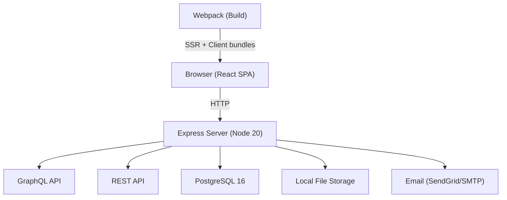
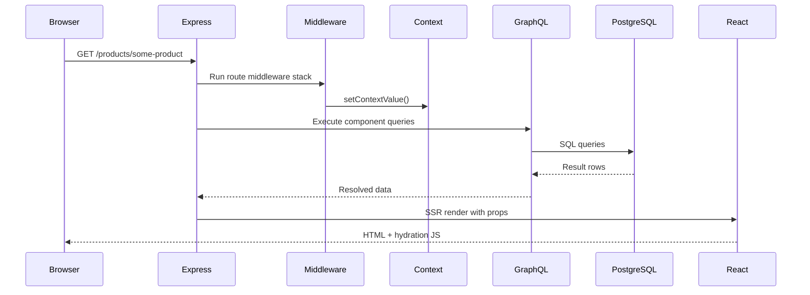
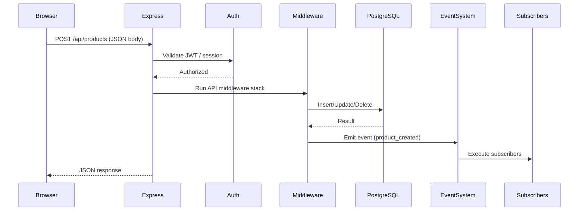
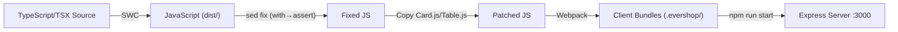

# Architecture — Full House (EverShop)

## High-Level Architecture



## System Layers

```
┌─────────────────────────────────────────────────┐
│                   Browser                        │
│  React Components (SSR hydrated on client)       │
├─────────────────────────────────────────────────┤
│                 Express Server                   │
│  ┌──────────┐ ┌──────────┐ ┌──────────────────┐ │
│  │ Pages    │ │ REST API │ │ GraphQL Endpoint │ │
│  │ (SSR)    │ │ (CRUD)   │ │ (Data Queries)   │ │
│  └──────────┘ └──────────┘ └──────────────────┘ │
│  ┌──────────────────────────────────────────────┐│
│  │  Middleware Pipeline (per route)             ││
│  └──────────────────────────────────────────────┘│
│  ┌──────────────────────────────────────────────┐│
│  │  Event System (Subscribers)                  ││
│  └──────────────────────────────────────────────┘│
│  ┌──────────────────────────────────────────────┐│
│  │  Extension System (Bootstrap Registry)       ││
│  └──────────────────────────────────────────────┘│
├─────────────────────────────────────────────────┤
│  PostgreSQL │ File Storage │ Email Service       │
└─────────────────────────────────────────────────┘
```

## Main Modules

### Core Modules (`packages/evershop/src/modules/`)

| Module      | Responsibility                                  |
|-------------|--------------------------------------------------|
| `auth`      | Admin authentication, JWT tokens, login/logout   |
| `base`      | Shared utilities, base middleware, Area system    |
| `catalog`   | Products, categories, collections, attributes, variants, search |
| `checkout`  | Cart, checkout flow, shipping, order placement   |
| `cms`       | CMS pages, static content management             |
| `cod`       | Cash-on-delivery payment method                  |
| `customer`  | Customer accounts, registration, profiles        |
| `graphql`   | GraphQL endpoint setup, schema merging           |
| `oms`       | Order management, status workflow, shipments     |
| `paypal`    | PayPal payment integration                       |
| `promotion` | Coupons, discount rules                          |
| `setting`   | Store settings, admin configuration              |
| `stripe`    | Stripe payment integration                       |
| `tax`       | Tax rules and calculation                        |

### Custom Extensions (`extensions/`)

| Extension            | Responsibility                              |
|----------------------|---------------------------------------------|
| `aiDescription`      | AI-generated product descriptions           |
| `buyNow`             | Instant purchase flow (skip cart)           |
| `dashboardAnalytics` | Admin dashboard stats and charts            |
| `emailNotifications` | Email templates and send logic              |
| `headerBar`          | Promotional announcement banner             |
| `inventoryHistory`   | Stock change audit trail                    |
| `orderDocuments`     | Invoice/receipt PDF generation              |
| `orderReturns`       | Return request workflow                     |
| `productExtra`       | Additional product attributes               |
| `productPromotion`   | Product-level promotional pricing           |
| `wishlist`           | Customer wishlist functionality             |

## Data Flow

### Page Request Flow



### API Request Flow



## Auth Flow

- **Admin**: Session-based auth with JWT tokens
  - Login: `POST /user/login` → returns JWT
  - Token stored in HTTP-only cookie (`admin-sid`)
  - Protected routes check session middleware
  - Logout: `GET|POST /user/logout`
- **Customer**: Session-based auth
  - Register: storefront registration form
  - Login: storefront login page
  - Session stored in cookie (`sid`)
- **API Access**: Routes default to `"access": "private"` (require auth)
  - Set `"access": "public"` in `route.json` for public endpoints

## API Structure

### REST API Pattern
- Route defined by: `<module>/api/<routeId>/route.json`
- `route.json` specifies `methods`, `path`, `access`
- Middleware files in the route folder execute in alphabetical order
- JSON body auto-parsed

### GraphQL
- Single endpoint served by the `graphql` module
- Types defined per module: `graphql/types/<TypeName>/<TypeName>.graphql`
- Resolvers co-located with schema files
- Components can export `query` string; data auto-injected as props

## Database / Schema Overview

- **PostgreSQL** with auto-migrations
- Migrations in `src/migration/Version-X.Y.Z.ts` per module
- Key tables (inferred from modules):
  - `admin_user` — admin accounts
  - `product`, `product_description`, `product_image` — catalog
  - `category`, `category_description` — categories
  - `collection` — product collections
  - `attribute`, `attribute_group` — product attributes
  - `variant_group` — product variants
  - `cart`, `cart_item` — shopping cart
  - `order`, `order_item`, `order_activity` — orders
  - `shipment` — shipments
  - `customer`, `customer_address` — customers
  - `coupon` — promotions
  - `tax_class`, `tax_rate` — tax
  - `cms_page` — CMS content
- Query builder: `@evershop/postgres-query-builder` (fluent API)

## Frontend / Backend Relationship

- **Server-Side Rendering (SSR)**: React components rendered on server, hydrated on client
- **Webpack**: Builds client-side bundles from React components
- **Area System**: Components declare `layout.areaId` and `sortOrder` to be placed in UI slots
- **Component Data**: Components export `query` (GraphQL) → data injected as props
- **Middleware → Component bridge**: `setContextValue()` in middleware, `getContextValue()` in resolvers
- **Styling**: Tailwind CSS 4, component-level SCSS

## Event System / Subscribers

Events are emitted after key operations. Subscribers react asynchronously.

| Event               | Triggered When              | Subscriber Actions          |
|---------------------|-----------------------------|-----------------------------|
| `product_created`   | New product saved           | Index, cache, notify        |
| `product_updated`   | Product modified            | Re-index, invalidate cache  |
| `product_deleted`   | Product removed             | Clean up references         |
| `category_created`  | New category saved          | Index                       |
| `category_updated`  | Category modified           | Re-index                    |
| `category_deleted`  | Category removed            | Clean up                    |
| `order_placed`      | New order submitted         | Email notification, stock   |
| `customer_registered` | New customer account      | Welcome email               |

Extensions can add custom subscribers in `src/subscribers/`.

## Build Pipeline



## Important Design Decisions

1. **File-based routing**: Routes discovered from folder structure, not a central router
2. **Extension-first customization**: Business logic goes in extensions, not core edits
3. **SSR + hydration**: SEO-friendly pages with client interactivity
4. **Area-based layout**: Composable UI via slot system (not rigid templates)
5. **Event-driven side effects**: Subscribers decouple business logic
6. **SWC over TSC**: Faster compilation (with caveats on Node 20)
7. **No dev server**: Production-only runtime; full rebuild for every change

## Tradeoffs and Constraints

| Decision                  | Tradeoff                                                |
|--------------------------|---------------------------------------------------------|
| SWC compiler             | Fast but produces `import with` syntax incompatible with Node 20 |
| No hot-reload            | Slower development cycle but simpler runtime            |
| French-only              | Simpler UX but limits market reach                      |
| Monorepo source checkout | Full control but heavier than a generated app           |
| PostgreSQL only           | No database portability but strong feature set          |
| Extension system          | Flexible but requires compile step per extension        |
| Tax-inclusive pricing     | Matches Tunisian norms but complicates price display logic |
